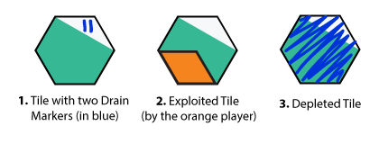

Last Land Rules v0.1
=================
This is a turn-based competitive board game for 2-6 players. Players seek to exploit the land tiles to collect the most resources (points). To achieve that, they move their avatars around the board, drain and explore tiles. The game board is destroyed throughout the game. Each game lasts more or less 30-45 minutes and consumes one board.

Components
-----------------
* 6x colored player *pins*
*  150x colored *exploitation tokens* (25 for each player with its respective color)
*  1x Hexagonal Grid Board with 37 *tiles*
*  2x six-sided dice

Setup
--------
1. Each player chooses one *pin* and grabs all *Exploitation Tokens* of its color
2. Each player puts his/her *pin* on a *Base Tile* -- *Tiles* marked with a **B** on the board. This positioning should be as symmetrically distant as possible.

Turn order
--------------
Each player rolls two dice. The one with the highest sum plays the first turn. Then the player to his/her left is the next and so on, following a clockwise order.

Turn rules
--------------
1. At the start of a turn the player rolls two dice and chooses one. Example: if he/she rolls 2 and 3, he/she can choose either 2 or 3. This will be the amount of *Action Points (AP)* he/she will have in this turn
2. The player uses *action points* to perform the following actions:
  * **Move**: moves his/her *pin* to an adjacent *tile*. There are some restrictions to movement explained in section Moving. Costs 1 *AP*
  * **Drain**: drains the *tile* putting a *drain marker* on it. *Drain markers* can be made with a stroke of a pen on the *tile*. Drain can cause *tile depletion*, explained in section Tile. Costs 1 *AP* per *drain marker*
  * **Exploit**: exploits the *tile* yielding score *points*. The player must mark the exploited *tile* with one of his/her *tokens*. Costs 1-4 *APs* (same as the *tile's score*)

###Turn considerations
* The player must use all of his/her *action points*
* Sometimes a player gets *trapped* and is unable to perform any action. At this point, the given player turn can be ignored, and he/she can take his/her *pin* out of the board
* **Drain** and **Exploit** actions can only be performed on the *tile* the player *pin* is on.

Scoring
----------
Players earn *points* by *exploiting* *tiles*. A player can't *exploit* a *tile* that's already under one of his/her *tokens*. *Points* earned varies upon *tile* type, see section Tile for details.

*Tiles* already *exploited* can be stolen by another player. To perform this action a player must *exploit* a *tile* that is under another player's *token*. The previous exploiter takes his/her *token* back and looses *points* accordingly, then the new exploiter puts his/her *token* on that *tile* as usual.

Advice: it's not necessary to write down players' score during the game. As the only way to score is by exploiting *tiles*, it's not difficult to count the *points* by looking at the board and adding up each players' score from his/hers placed *tokens*.

Moving
----------
The action move has the following restrictions:
* A *pin* can only *move* to an adjacent *tile*
* **Body block**: it's not possible to move to a *tile* if another player's *pin* is on that *tile*
* it's not possible to move to a *depleted tile* 
* **Move Drain**: once a *pin* is moved out of a *tile*, this *tile* receives a *drain marker*. In other words, if a *pin* is moved from *tile* *A* to *tile* *B*, *tile* *A* receives one *drain marker*

Given the above restrictions of movement, note that a player may get *trapped*. This means being unable to *move* to any *tile*.

Tiles 
-------
Each hexagon in the game board is a *tile*. The following rules apply to them:

1. There are 5 different *types of tiles* *
  1. **Base**: costs 4 *AP* to *exploit*, yields 4 *points*
  2. **T1**:  costs 1 *AP* to *exploit*, yields 1 *point*
  3. **T2**:  costs 2 *AP* to *exploit*, yields 2 *points*
  4. **T3**:  costs 3 *AP* to *exploit*, yields 3 *points*
  5. **T4**:  costs 4 *AP* to *exploit*, yields 4 *points*
2. **Depletion**: a *tile* becomes *depleted* once it reaches 4 *drain markers*. Newly *depleted tiles* maintain *exploitation tokens*. Players should mark *depleted* *tiles* scribbling on them with a pen. This "ruins" the board -- don't worry, this game is designed to do just that. 

*The tiles types and points are also displayed on the board

###Examples on tiles
See the image below for examples on:

1. Put *drain markers* on *tiles*
2. Mark an *exploited tile*
3. Scribble a *depleted tile*

Winning the game
--------------------------
The player with the most *points* at the end of the game wins. The game ends when it's not possible for any player to perform any action -- this normally happens when most *tiles* are *depleted*.

